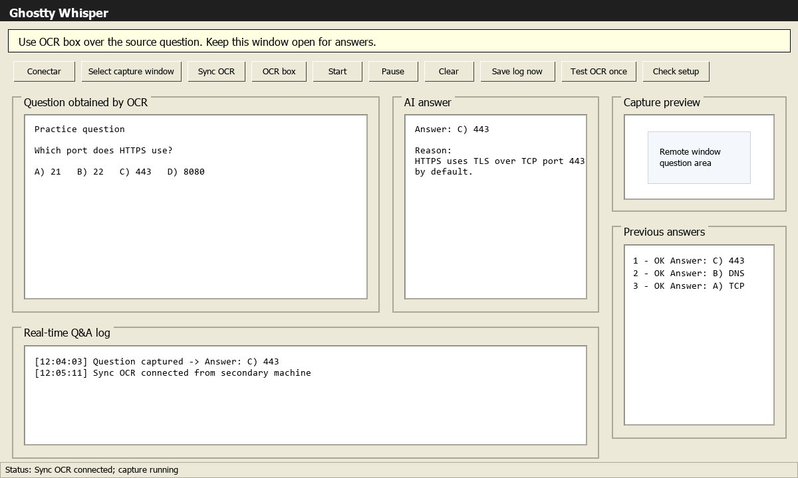
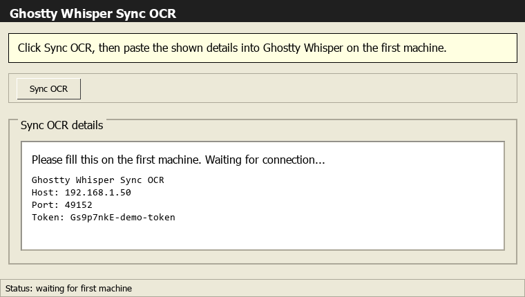
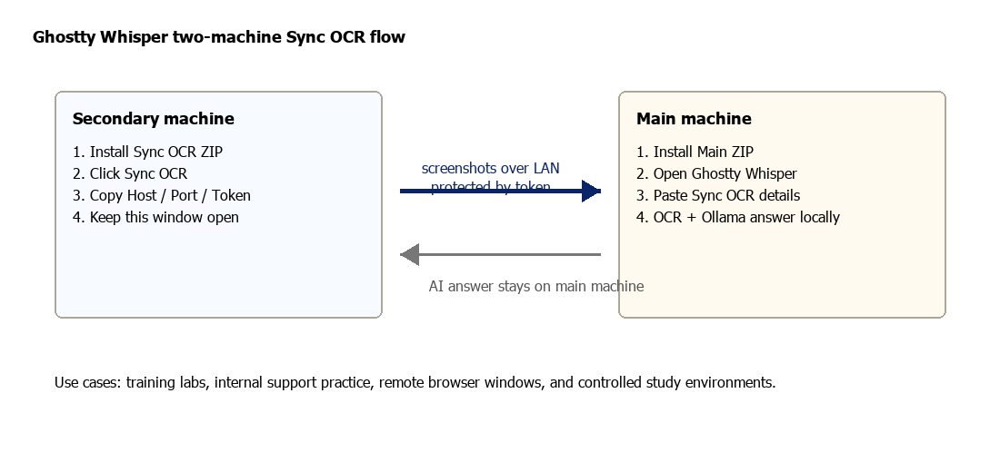

# Gwisp

**Alpha build 1.0.3**

**Copyright (c) 2026 Raphael (@fantasmagorikus). All rights reserved.**

> **EN:** A Windows desktop OCR assistant that captures questions from the screen,
> reads them with Tesseract, and sends the cleaned text to a local Ollama model.
> It also includes **Sync OCR**, a companion app for capturing a second machine
> over your trusted local network.
>
> **PT-BR:** Um assistente desktop para Windows que captura perguntas da tela,
> le com Tesseract e envia o texto limpo para um modelo local no Ollama. Tambem
> inclui o **Sync OCR**, um app companheiro para capturar uma segunda maquina na
> sua rede local confiavel.
>
> **DE:** Ein Windows-Desktop-OCR-Assistent, der Fragen vom Bildschirm erfasst,
> sie mit Tesseract liest und den bereinigten Text an ein lokales Ollama-Modell
> sendet. Enthalten ist auch **Sync OCR**, eine Begleit-App zur Erfassung eines
> zweiten Rechners im vertrauenswuerdigen lokalen Netzwerk.

> **Responsible-use warning:** The developer of this project does not recommend
> using Gwisp in evaluated certifications, real exams, paid graded activities, or
> any activity where outside assistance is prohibited. This is an alpha lab/test
> tool and must be treated as such. The developer is not responsible for answer
> accuracy in evaluated, graded, or paid activities. Use responsibly and at your
> own risk.
>
> **Aviso de uso responsavel:** O desenvolvedor deste projeto nao recomenda o
> uso do Gwisp em certificacoes avaliadas, provas reais, atividades pagas para
> serem realizadas, ou qualquer atividade em que ajuda externa seja proibida.
> Este e um software alpha de laboratorio/teste e deve ser tratado como tal. O
> desenvolvedor nao se responsabiliza pela accuracy das respostas em atividades
> avaliadas por nota ou pagas. Use com responsabilidade e assumindo seu proprio
> risco.
>
> **Hinweis zur verantwortlichen Nutzung:** Der Entwickler dieses Projekts
> empfiehlt nicht, Gwisp in bewerteten Zertifizierungen, echten Pruefungen,
> bezahlten benoteten Aufgaben oder Aktivitaeten zu nutzen, bei denen externe
> Hilfe verboten ist. Dies ist ein Alpha-Labor/Test-Tool und muss so behandelt
> werden. Der Entwickler uebernimmt keine Verantwortung fuer die Genauigkeit der
> Antworten in bewerteten, benoteten oder bezahlten Aktivitaeten. Nutzung auf
> eigene Verantwortung.

<p align="center">
  
</p>

## Downloads

| App | Download | What it installs |
| --- | --- | --- |
| Gwisp Setup EXE | [Download Windows setup EXE](https://github.com/fantasmagorikus/gwisp/releases/latest/download/Gwisp-Setup.exe) | Alpha build 1.0.3 installer window with Main, Sync OCR, or both |
| Gwisp Main | [Download Windows installer ZIP](https://github.com/fantasmagorikus/gwisp/releases/latest/download/Gwisp-Main-Windows.zip) | Alpha build 1.0.3 main OCR + Ollama desktop app |
| Gwisp Sync OCR | [Download Windows installer ZIP](https://github.com/fantasmagorikus/gwisp/releases/latest/download/Gwisp-SyncOCR-Windows.zip) | Alpha build 1.0.3 secondary-machine capture companion |

> Run `Gwisp-Setup.exe` for the guided installer. The ZIP downloads
> are still available as manual fallback packages. The installer and both
> desktop apps include language selection for 🏴 English, 🇧🇷 Portuguese,
> and 🇩🇪 German. Alpha build 1.0.3 is currently tested on Windows 11 only.
>
> Execute `Gwisp-Setup.exe` para abrir o instalador guiado. Os ZIPs
> continuam disponiveis como fallback manual. O instalador e os dois apps
> incluem selecao de idioma para 🏴 ingles, 🇧🇷 portugues e 🇩🇪 alemao.
> A versao alpha build 1.0.3 foi testada por enquanto apenas no Windows 11.
>
> Fuehren Sie `Gwisp-Setup.exe` aus, um den gefuehrten Installer zu oeffnen.
> Die ZIP-Downloads bleiben als manuelle Installationsoption verfuegbar.
> Installer und beide Desktop-Apps enthalten eine Sprachauswahl fuer
> 🏴 Englisch, 🇧🇷 Portugiesisch und 🇩🇪 Deutsch. Alpha build 1.0.3 ist
> aktuell nur unter Windows 11 getestet.

## Windows 11 Status

- Current release: **Alpha build 1.0.3**.
- Tested target: **Windows 11**. Windows 10 and other Windows versions are not
  validated yet.
- The default installer path does not require administrator rights.
- The default installer path does not create Desktop/Start Menu shortcuts, which
  avoids a common shortcut/COM false-positive path. Use the `Run-Gwisp-*.bat`
  launchers created in the selected install folder.
- The EXE is not code-signed yet. Windows SmartScreen or "unknown publisher"
  prompts can still appear for public downloads until the project is signed with
  a trusted code-signing certificate.

## Support The Project

If Gwisp helps you, you can support the project with BTC or Monero. The same
addresses are also available from the `Support` button inside the desktop apps.

Bitcoin:

```text
bc1qfnlslkc9lm7327d8ruz6us6rs25299fx752h4j
```

Monero:

```text
46qeT3qhJgfYditXfaSqM1enNAottE26EQczmtNbiT57iJzFRHxuBjQN3jdtM8FPwFMRtQYWc9CSXBYLT7RhBaHcBfDvwrE
```

PT-BR: Se o Gwisp te ajuda, voce pode apoiar o projeto com uma doacao em
cripto. Verifique o endereco antes de enviar.

DE: Wenn Gwisp hilfreich ist, kannst du das Projekt mit einer Krypto-Spende
unterstuetzen. Bitte pruefe die Adresse vor dem Senden.



## English

### What It Does

Gwisp is built for controlled practice, training labs, support
workflows, and local study environments where you need fast OCR over a screen
region and a local AI answer. The main app stays on your machine; OCR text goes
to your configured local Ollama endpoint.

### Use Cases

- Practice quizzes and training labs where the question appears on screen.
- Internal support or QA simulations where operators need quick answer drafts.
- Remote browser or VM windows captured through `OCR box` or `Select capture window`.
- Two-machine setups where the source screen must stay fullscreen on another PC.
- Offline/local AI workflows that should avoid paid API keys.

### Quick Install

Recommended EXE installer:

```powershell
# Download Gwisp-Setup.exe, run it, then choose:
# - 🏴 English / 🇧🇷 Portuguese / 🇩🇪 German
# - Both: full main app + Sync OCR
# - Only the full main app
# - Only Sync OCR
```

Manual ZIP install for the main machine:

```powershell
# 1. Download and extract Gwisp-Main-Windows.zip
# 2. Run:
powershell -ExecutionPolicy Bypass -File .\Install-Gwisp-Main.ps1 -Language en
```

Manual ZIP install for the secondary machine:

```powershell
# 1. Download and extract Gwisp-SyncOCR-Windows.zip
# 2. Run:
powershell -ExecutionPolicy Bypass -File .\Install-Gwisp-SyncOCR.ps1 -Language en
```

Optional shortcuts for manual installs:

```powershell
powershell -ExecutionPolicy Bypass -File .\Install-Gwisp-Main.ps1 -Language en -CreateShortcuts
```

### Main App Workflow

1. Install Python 3.11+, Tesseract OCR, and Ollama on the main machine.
2. Install **Gwisp Main**.
3. Open the launcher shown by the installer.
4. Click `Check setup`.
5. Click `Load model`.
6. Choose one capture mode:
   - `OCR box`: drag a small box over the question.
   - `Select capture window`: capture a selected Windows window.
   - `Sync OCR`: connect to the companion app running on another machine.
7. Click `Start` or use the automatic start from `Sync OCR`.

### Sync OCR Workflow



1. On the secondary machine, open **Gwisp Sync OCR**.
2. Click `Sync OCR`.
3. Copy the shown connection details.
4. On the main machine, open **Gwisp Main** and click `Sync OCR`.
5. Paste the details and connect.

Example pairing data:

```text
Gwisp Sync OCR
Host: 192.168.1.50
Port: 49152
Token: Gs9p7nkE-demo-token
```



### Expected Answer Format

The prompt asks the local model to respond with the likely answer first, then a
short explanation:

```text
Answer: B) option text
Reason:
- Short reason.
```

### Requirements

- Windows 11. This alpha build is currently tested only on Windows 11.
- Python 3.11 or newer.
- Tesseract OCR on the main machine.
- Ollama on the main machine.
- Both machines on the same trusted local network for Sync OCR.

## Portugues

### O Que Ele Faz

Gwisp foi feito para ambientes controlados de pratica, laboratorios,
treinamento e suporte, onde voce precisa capturar rapidamente uma pergunta da
tela via OCR e gerar uma resposta com IA local. O app principal fica na sua
maquina; o texto OCR vai para o Ollama configurado localmente.

### Casos De Uso

- Quizzes de estudo e laboratorios de treinamento.
- Simulacoes internas de suporte ou QA.
- Janelas remotas, navegadores ou VMs capturados por `OCR box` ou `Select capture window`.
- Setup com duas maquinas, quando a tela fonte precisa ficar fullscreen em outro PC.
- Fluxos locais/offline que nao devem depender de chave paga de API.

### Instalacao Rapida

Instalador EXE recomendado:

```powershell
# Baixe Gwisp-Setup.exe, execute e escolha:
# - 🏴 ingles / 🇧🇷 portugues / 🇩🇪 alemao
# - Os dois
# - Somente app principal completo
# - Somente Sync OCR
```

Instalacao manual por ZIP para a maquina principal:

```powershell
# 1. Baixe e extraia Gwisp-Main-Windows.zip
# 2. Execute:
powershell -ExecutionPolicy Bypass -File .\Install-Gwisp-Main.ps1 -Language pt
```

Instalacao manual por ZIP para a maquina secundaria:

```powershell
# 1. Baixe e extraia Gwisp-SyncOCR-Windows.zip
# 2. Execute:
powershell -ExecutionPolicy Bypass -File .\Install-Gwisp-SyncOCR.ps1 -Language pt
```

Atalhos opcionais na instalacao manual:

```powershell
powershell -ExecutionPolicy Bypass -File .\Install-Gwisp-Main.ps1 -Language pt -CreateShortcuts
```

### Uso Do App Principal

1. Instale Python 3.11+, Tesseract OCR e Ollama na maquina principal.
2. Instale o **Gwisp Main**.
3. Abra o launcher mostrado pelo instalador.
4. Clique em `Check setup`.
5. Clique em `Load model`.
6. Escolha uma fonte de captura:
   - `OCR box`: caixa pequena arrastavel sobre a pergunta.
   - `Select capture window`: captura uma janela selecionada do Windows.
   - `Sync OCR`: conecta no app companheiro rodando em outra maquina.
7. Clique em `Start` ou deixe o `Sync OCR` iniciar automaticamente.

### Uso Do Sync OCR

1. Na maquina secundaria, abra **Gwisp Sync OCR**.
2. Clique em `Sync OCR`.
3. Copie `Host`, `Port` e `Token`.
4. Na maquina principal, abra **Gwisp Main** e clique em `Sync OCR`.
5. Cole os dados e conecte.

Enquanto os dados nao forem colocados na maquina principal, a secundaria mostra:

```text
Please fill this on the first machine. Waiting for connection...
```

### Requisitos

- Windows 11. Esta build alpha foi testada por enquanto apenas no Windows 11.
- Python 3.11 ou mais recente.
- Tesseract OCR na maquina principal.
- Ollama na maquina principal.
- As duas maquinas na mesma rede local confiavel para usar Sync OCR.

## Deutsch

### Was Es Macht

Gwisp ist fuer kontrollierte Uebungen, Trainingslabore, Support-Workflows und
lokale Lernumgebungen gebaut, in denen eine Frage schnell per OCR vom
Bildschirm erfasst und mit lokaler KI beantwortet werden soll. Die Haupt-App
bleibt auf dem eigenen Rechner; der OCR-Text geht an den lokal konfigurierten
Ollama-Endpunkt.

### Anwendungsfaelle

- Uebungs-Quizzes und Trainingslabore, bei denen die Frage auf dem Bildschirm
  erscheint.
- Interne Support- oder QA-Simulationen mit schnellen Antwortentwuerfen.
- Remote-Browser, VM-Fenster oder Windows-Fenster ueber `OCR box` oder
  `Select capture window`.
- Zwei-Rechner-Setups, wenn der Quellbildschirm auf einem anderen PC im
  Vollbild bleiben muss.
- Lokale/offline KI-Workflows ohne bezahlte API-Schluessel.

### Schnellinstallation

Empfohlener EXE-Installer:

```powershell
# Gwisp-Setup.exe herunterladen, ausfuehren und waehlen:
# - 🏴 Englisch / 🇧🇷 Portugiesisch / 🇩🇪 Deutsch
# - Beides: komplette Haupt-App + Sync OCR
# - Nur komplette Haupt-App
# - Nur Sync OCR
```

Manuelle ZIP-Installation fuer den Hauptrechner:

```powershell
# 1. Gwisp-Main-Windows.zip herunterladen und entpacken
# 2. Ausfuehren:
powershell -ExecutionPolicy Bypass -File .\Install-Gwisp-Main.ps1 -Language de
```

Manuelle ZIP-Installation fuer den zweiten Rechner:

```powershell
# 1. Gwisp-SyncOCR-Windows.zip herunterladen und entpacken
# 2. Ausfuehren:
powershell -ExecutionPolicy Bypass -File .\Install-Gwisp-SyncOCR.ps1 -Language de
```

Optionale Verknuepfungen bei manueller Installation:

```powershell
powershell -ExecutionPolicy Bypass -File .\Install-Gwisp-Main.ps1 -Language de -CreateShortcuts
```

### Ablauf In Der Haupt-App

1. Python 3.11+, Tesseract OCR und Ollama auf dem Hauptrechner installieren.
2. **Gwisp Main** installieren.
3. Den Launcher aus dem Installationsordner oeffnen.
4. `Check setup` anklicken.
5. `Load model` anklicken.
6. Eine Capture-Quelle waehlen:
   - `OCR box`: kleines verschiebbares Feld ueber der Frage.
   - `Select capture window`: ein ausgewaehltes Windows-Fenster erfassen.
   - `Sync OCR`: mit der Begleit-App auf einem anderen Rechner verbinden.
7. `Start` anklicken oder den automatischen Start von `Sync OCR` nutzen.

### Sync-OCR-Nutzung

1. Auf dem zweiten Rechner **Gwisp Sync OCR** oeffnen.
2. `Sync OCR` anklicken.
3. `Host`, `Port` und `Token` kopieren.
4. Auf dem Hauptrechner **Gwisp Main** oeffnen und `Sync OCR` anklicken.
5. Daten einfuegen und verbinden.

### Voraussetzungen

- Windows 11. Diese Alpha-Build ist aktuell nur unter Windows 11 getestet.
- Python 3.11 oder neuer.
- Tesseract OCR auf dem Hauptrechner.
- Ollama auf dem Hauptrechner.
- Beide Rechner im selben vertrauenswuerdigen lokalen Netzwerk fuer Sync OCR.

## Developer Setup

```powershell
python -m pip install -e ".[dev]"
python -m pytest
python -m ruff check .
python -m ruff format --check .
```

Build the downloadable ZIPs:

```powershell
powershell -ExecutionPolicy Bypass -File .\packaging\windows\Build-ReleaseZips.ps1
```

Build the ZIPs and the setup EXE:

```powershell
powershell -ExecutionPolicy Bypass -File .\packaging\windows\Build-WindowsInstaller.ps1
```

## Project Structure

- `src/gwisp/`: Python package source.
- `src/gwisp/ui/`: Qt/PySide6 windows.
- `src/gwisp/adapters/`: screen, window, Sync OCR, Tesseract, Ollama, and log adapters.
- `src/gwisp/services/`: OCR cleanup, prompts, duplicate detection, and QA pipeline.
- `src/gwisp/assets/`: packaged app icon.
- `downloads/`: versioned installer ZIPs linked from this README.
- `packaging/windows/`: installer scripts, bootstrapper source, and Windows build scripts.
- `docs/images/`: README images.
- `tests/`: automated tests.

## Privacy And Security

- The main app sends OCR text only to the configured Ollama endpoint by default.
- Screenshots are not saved by the app; preview images stay in memory/UI.
- Sync OCR transfers screenshots over your trusted local network only after token pairing.
- Sync OCR uses local HTTP with a high-entropy bearer token; do not use it on
  untrusted Wi-Fi or networks where traffic may be inspected.
- Do not configure `ollama_url` to a remote service unless you are comfortable
  sending captured OCR text to that service.
- Use Sync OCR only on trusted networks.
- Logs and local configs are ignored by Git because they may contain private data.

## License

This project is proprietary. Copyright (c) 2026 Raphael (@fantasmagorikus).
All rights reserved. See [LICENSE](LICENSE).
